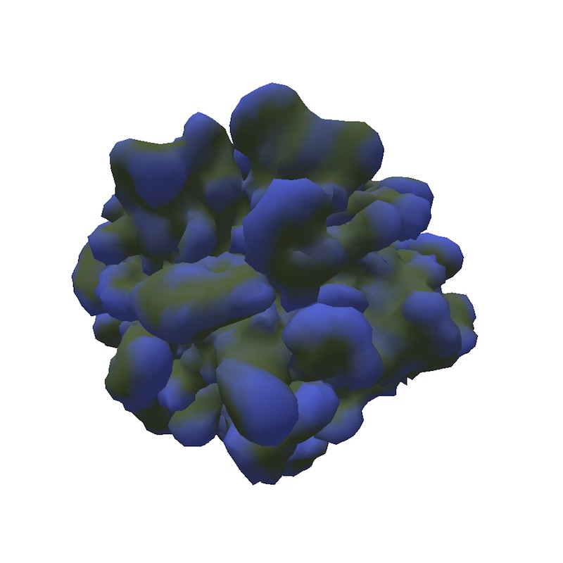

# Reaction Diffusion on 3D Mesh
Uses Gray-Scott model. Growth is proportional to chemical U. 

Requires my dyamic half-edge mesh library [cymesh](https://github.com/Sloth6/cymesh) which handles edge splitting and preventign self-intersections. Also Cython, pygame and pyopengl.

Just run
```
python main.py
```

